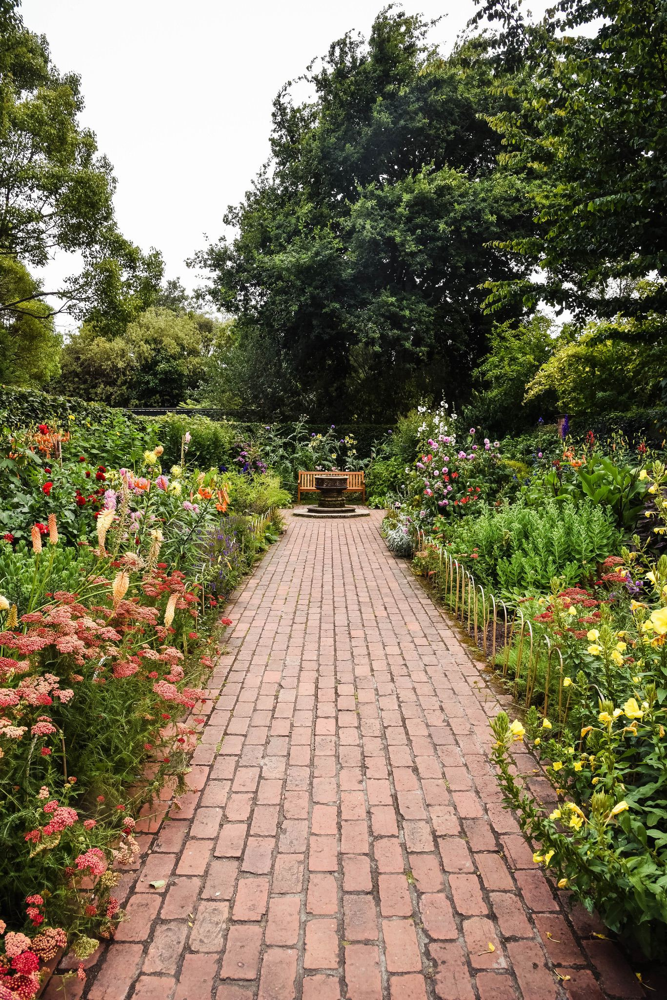

# React Intro Kursus 1/2

`09:15 --` Introduktion
`09:30 --` _Kaffepause_
`10:00 --` Ren React
`10:20 --` React med hjælpeværktøjer
`10:40 --` Styling
`11:00 --` Opgave
`12:00 --` _Frokost_
`12:30 --` Arbejde videre på opgaven

---

# Introduktion

## Hvad kommer vi til at lære?

1. Ren React
2. React med hjælpeværktøjer
3. IST-React med TypeScript, Material-UI og Emotion

---

# Hvad er React?

_Et JavaScript bibliotek til at bygge brugergrænseflader_

## Andre JavaScript biblioteker

- GWT
- Vue
- Angular
- Svelte

---

# Hvorfor React?

- _Reaktivt_
- Komponentbaseret med lokal state
- Hurtigt og crossplatform-venligt

  - React DOM (Virtual DOM)
  - React DOM Server
  - React Native DOM

---

# Ren React

_Hvordan kommer vi igang?_

[Hello World CodeSandbox](https://codesandbox.io/s/1-ren-react-pce83)

---

# React med hjælpeværktøjer

- Pakkemanager med npm / Yarn
- Kompilering / transpilering med Babel
- JSX
  - Næsten HTML og så alligevel ikke
- Prettier
- ESLint
- Hot Reloading 🔥🔥🔥

[React CodeSandbox](https://codesandbox.io/s/2-react-med-hjaelpevaerktojer-2zti8)

---

# Styling

- CSS filer
  - Eller LESS / SASS / SCSS
- PostCSS
- CSS-in-JS
  - Styled Components / Emotion
- Lokal Scoping 👼

[React Styling CodeSandbox](https://codesandbox.io/s/3-react-styling-7rlwk)

---

# Quiztid!

[Kahoot](https://create.kahoot.it/details/react-intro-quiz/d1c20df9-df6a-4473-8cfd-cdd299f7bd04)

^Pas på, spørgsmålene er synlige på linket 😳

---

# Hvad vil I gerne høre om på fredag?

Idéer 💡

- Se hvordan IST-UDDATA React projektet virker
- Teknisk oplæg om
  - TypeScript og React, f.eks. TSX og typer
  - Vores komponentbibliotek Material-UI
  - Emotion, CSS-in-JS
- Bygge en ny minifeature sammen til IST-UDDATA
- Hvad tænker du?

---

# Opgave

Vi skal bygge en _ReactRegner_

- Eksempel
- JavaScript `eval()`
- Byg direkte i [CodeSandbox](https://codesandbox.io/s/github/mellson/react-intro-opgave)
- Eller hent [starter repo her](https://github.com/mellson/react-intro-opgave)

Fredag kigger vi på hinandens forskellige løsninger 🎉
